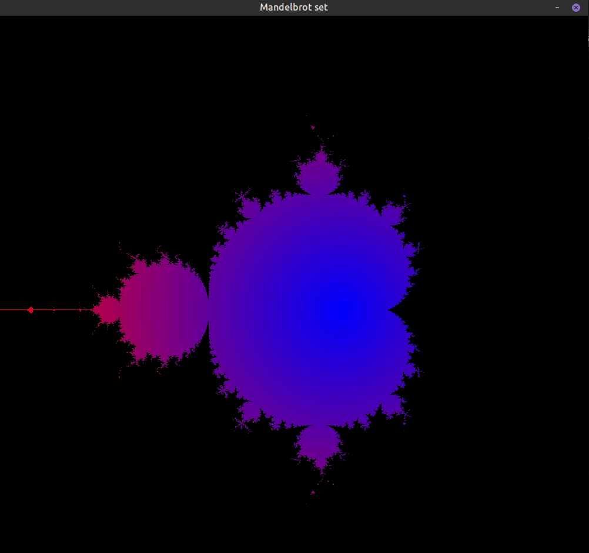

# Mandelbrot set
This is simple program written in c which renders mandelbrot set.

## Compiling the program

``` bash
gcc mandelbrot.c -o mandelbrot -lSDL2 -lm
```

Default number of iterations is 50. Number of iterations can also be passed as commandline argument.

## Running the program

``` bash
./mandelbrot \#no_of_iterations
```

## Screenshot

